# System Design — Attendance Web App

> A comprehensive system design document for the college attendance management system.
> Tech Stack: Spring Boot (Java) + MySQL + Spring Security (JWT) + Thymeleaf/React

---

## 1. High-Level Architecture

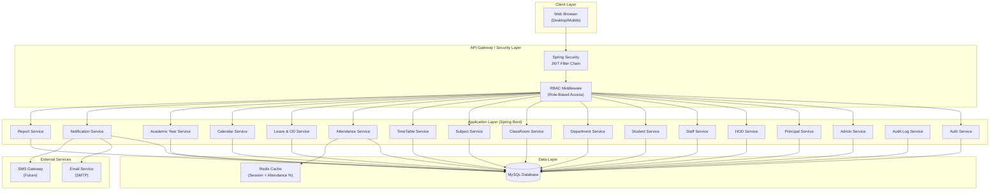

### Architecture Style: **Layered Monolith (Modular)**

> For a 7-day MVP sprint by a single developer, a modular monolith is the optimal choice. Each module is a separate package but deployed as a single Spring Boot JAR. This can be evolved into microservices later.

```
com.attendance/
├── config/            # Spring Security, JWT, CORS, Redis configs
├── common/            # Shared utilities, exceptions, DTOs
├── auth/              # Authentication & Authorization
├── admin/             # Admin module
├── principal/         # Principal module
├── hod/               # HOD module  
├── staff/             # Staff module
├── student/           # Student module
├── department/        # Department module
├── classroom/         # ClassRoom module
├── subject/           # Subject module
├── timetable/         # TimeTable module
├── attendance/        # Attendance module
├── leave/             # Leave & OD module
├── calendar/          # Calendar module
├── academicyear/      # Academic Year module
├── notification/      # Notification module
├── audit/             # Audit Log module
└── report/            # Report generation module
```

Each module follows:
```
module/
├── controller/        # REST Controllers (API endpoints)
├── service/           # Business logic
├── repository/        # JPA Repositories (Data access)
├── model/             # Entity classes (JPA)
├── dto/               # Request/Response DTOs
└── exception/         # Module-specific exceptions
```

---

## 2. Database Schema (ER Diagram)

```mermaid
erDiagram
    USER ||--o{ NOTIFICATION : receives
    USER {
        bigint id PK
        varchar email UK
        varchar password_hash
        enum role "ADMIN|PRINCIPAL|HOD|STAFF|STUDENT"
        boolean is_active
        boolean must_change_password
        datetime created_at
        datetime updated_at
        bigint created_by FK
    }

    DEPARTMENT ||--o{ CLASSROOM : contains
    DEPARTMENT ||--o{ SUBJECT : has
    DEPARTMENT {
        bigint id PK
        varchar name UK
        varchar code UK
        bigint hod_id FK
        enum status "ACTIVE|INACTIVE|HOD_UNASSIGNED"
        datetime created_at
    }

    CLASSROOM ||--o{ STUDENT_CLASS : enrolls
    CLASSROOM ||--|| TIMETABLE : has
    CLASSROOM {
        bigint id PK
        varchar name
        varchar code UK
        bigint department_id FK
        int year
        int semester
        bigint class_advisor_id FK
        enum status "PENDING|ACTIVE|REJECTED|ARCHIVED"
        varchar rejection_reason
        datetime created_at
    }

    SUBJECT ||--o{ TIMETABLE_SLOT : scheduled_in
    SUBJECT {
        bigint id PK
        varchar name
        varchar code
        enum type "THEORY|PRACTICAL|INTEGRATED"
        int credits
        int semester
        bigint department_id FK
        bigint classroom_id FK
        bigint staff_id FK
        bigint lab_staff_id FK
        int hours_per_week
        enum status "ACTIVE|ARCHIVED|STAFF_TBA"
        datetime created_at
    }

    STAFF {
        bigint user_id PK,FK
        varchar name
        varchar employee_id UK
        bigint department_id FK
        boolean is_class_advisor
        boolean is_hod
        boolean is_acting_hod
        datetime acting_hod_start
        datetime acting_hod_end
        enum status "ACTIVE|INACTIVE"
    }

    STUDENT {
        bigint user_id PK,FK
        varchar roll_no UK
        varchar name
        int current_year
        int batch_year
        bigint department_id FK
        int semester
        enum gender "MALE|FEMALE|OTHER"
        varchar phone
        varchar parent_phone
        varchar blood_group
        varchar community
        enum status "ACTIVE|DROPPED_OUT|TRANSFERRED|SUSPENDED|GRADUATED"
        date suspension_start
        date suspension_end
        date join_date
        datetime created_at
    }

    STUDENT_CLASS {
        bigint id PK
        bigint student_id FK
        bigint classroom_id FK
        date enrolled_from
        date enrolled_to
        boolean is_active
    }

    TIMETABLE {
        bigint id PK
        bigint classroom_id FK,UK
        bigint academic_year_id FK
        int semester
        datetime created_at
        bigint created_by FK
    }

    TIMETABLE_SLOT {
        bigint id PK
        bigint timetable_id FK
        enum day "MON|TUE|WED|THU|FRI|SAT"
        int period_number
        time start_time
        time end_time
        enum type "REGULAR|BREAK|LUNCH"
        bigint subject_id FK
        bigint staff_id FK
    }

    TIMETABLE_OVERRIDE {
        bigint id PK
        bigint timetable_id FK
        date specific_date
        int period_number
        bigint original_subject_id FK
        bigint override_subject_id FK
        bigint override_staff_id FK
        varchar reason
        bigint created_by FK
        datetime created_at
    }

    ATTENDANCE_RECORD {
        bigint id PK
        bigint student_id FK
        bigint subject_id FK
        bigint classroom_id FK
        date attendance_date
        int period_number
        bigint marked_by FK
        enum status "P|A|IL|UL|OD|SA|SU|NM|H"
        bigint modified_by FK
        varchar modification_reason
        datetime created_at
        datetime updated_at
        int version "optimistic_lock"
    }

    LEAVE_REQUEST {
        bigint id PK
        bigint student_id FK
        enum type "INFORMED_LEAVE|OD"
        date start_date
        date end_date
        varchar reason
        varchar event_name
        enum status "PENDING_ADVISOR|ADVISOR_APPROVED|ADVISOR_REJECTED|PENDING_HOD|HOD_APPROVED|HOD_REJECTED|CANCELLED|ESCALATED_TO_HOD|ESCALATED_TO_PRINCIPAL"
        bigint advisor_id FK
        bigint hod_id FK
        varchar advisor_remarks
        varchar hod_remarks
        boolean is_retroactive
        boolean is_partial
        datetime submitted_at
        datetime resolved_at
    }

    LEAVE_PERIOD_SLOT {
        bigint id PK
        bigint leave_request_id FK
        date slot_date
        int period_number
    }

    CALENDAR_ENTRY {
        bigint id PK
        date calendar_date UK
        enum day_type "WORKING|HOLIDAY|HALF_DAY"
        varchar holiday_name
        bigint created_by FK
        datetime created_at
    }

    HALF_DAY_CANCELLED_PERIOD {
        bigint id PK
        bigint calendar_entry_id FK
        int period_number
    }

    SATURDAY_CONFIG {
        bigint id PK
        date saturday_date UK
        boolean is_working_day
        enum cyclic_weekday "MON|TUE|WED|THU|FRI"
        boolean is_overridden
        bigint enabled_by FK
        datetime enabled_at
    }

    ACADEMIC_YEAR {
        bigint id PK
        varchar year_label
        date semester_start
        date semester_end
        int semester_length_weeks
        enum status "UPCOMING|ACTIVE|ENDED|ARCHIVED"
        bigint created_by FK
        datetime created_at
    }

    SYSTEM_CONFIG {
        bigint id PK
        int periods_per_day
        enum working_days "MON_TO_FRI|MON_TO_SAT"
        float default_attendance_threshold
        int max_leave_limit_per_semester
        int max_od_days_per_semester
        bigint active_principal_id FK
        bigint active_academic_year_id FK
    }

    DEPARTMENT_CONFIG {
        bigint id PK
        bigint department_id FK,UK
        int leave_limit_per_semester
        float attendance_threshold
    }

    NOTIFICATION {
        bigint id PK
        bigint user_id FK
        enum event_type "LOW_ATTENDANCE|LEAVE_SUBMITTED|LEAVE_APPROVED|LEAVE_REJECTED|etc"
        varchar title
        text message
        boolean is_read
        boolean is_critical
        datetime created_at
        datetime read_at
    }

    AUDIT_LOG {
        bigint id PK
        datetime timestamp
        bigint actor_id FK
        enum actor_role "ADMIN|PRINCIPAL|HOD|STAFF|STUDENT"
        varchar action_type
        varchar target_entity
        bigint target_id
        text old_value
        text new_value
        text reason
        bigint approved_by FK
        varchar tag
    }

    PRINCIPAL_DELEGATE {
        bigint id PK
        bigint hod_id FK
        date delegate_start
        date delegate_end
        boolean is_active
        bigint assigned_by FK
    }

    ESCALATION_LOG {
        bigint id PK
        bigint student_id FK
        bigint leave_request_id FK
        enum escalation_type "MANUAL|AUTO"
        int semester
        datetime escalated_at
    }

    USER ||--o| STAFF : "is a"
    USER ||--o| STUDENT : "is a"
    DEPARTMENT ||--o| STAFF : "has HOD"
    CLASSROOM ||--o| STAFF : "has advisor"
    SUBJECT ||--o| STAFF : "taught by"
    STUDENT ||--o{ ATTENDANCE_RECORD : has
    STUDENT ||--o{ LEAVE_REQUEST : submits
    LEAVE_REQUEST ||--o{ LEAVE_PERIOD_SLOT : covers
    CALENDAR_ENTRY ||--o{ HALF_DAY_CANCELLED_PERIOD : cancels
    TIMETABLE ||--o{ TIMETABLE_SLOT : contains
    TIMETABLE ||--o{ TIMETABLE_OVERRIDE : has
    ACADEMIC_YEAR ||--o{ TIMETABLE : governs
```

### Key Design Decisions

| Decision | Rationale |
|---|---|
| Single `USER` table with `role` enum | All roles share the same login mechanism. Role-specific data in separate tables (`STAFF`, `STUDENT`) |
| `ATTENDANCE_RECORD` per-period per-student | Core requirement — not per-day. Enables granular tracking |
| Optimistic locking on `ATTENDANCE_RECORD` | Handles concurrent corrections (EC-HOD-08) |
| `AUDIT_LOG` is append-only | NFR compliance — no UPDATE/DELETE on audit records |
| Computed fields (student count, attendance %) | Never stored statically — always calculated via queries |
| `TIMETABLE_OVERRIDE` separate from slots | Keeps regular schedule clean; overrides are date-specific |
| `LEAVE_PERIOD_SLOT` for partial ODs | Supports half-day ODs (EC-LEAVE-07) |

---

## 3. Unique Constraints & Indexes

| Table | Unique Constraint | Purpose |
|---|---|---|
| `USER` | `email` | No duplicate accounts (EC-AUTH-04) |
| `DEPARTMENT` | `name`, `code` | No duplicate depts (EC-DEPT-01) |
| `CLASSROOM` | `code` | No duplicate class codes |
| `CLASSROOM` | `(name, department_id, year, semester)` | No duplicate classes (EC-CLASS-03) |
| `ATTENDANCE_RECORD` | `(student_id, attendance_date, period_number, subject_id)` | No duplicate attendance (EC-ATT-03) |
| `CALENDAR_ENTRY` | `calendar_date` | One entry per date (EC-CAL-03) |
| `SATURDAY_CONFIG` | `saturday_date` | One config per Saturday |
| `STUDENT` | `roll_no` | Unique roll numbers |
| `STAFF` | `employee_id` | Unique employee IDs |
| `LEAVE_REQUEST` | `(student_id, start_date, type)` | Prevent duplicate requests (EC-LEAVE-10) |

### Critical Indexes

```sql
-- Attendance queries (most frequently hit)
CREATE INDEX idx_att_student_date ON attendance_record(student_id, attendance_date);
CREATE INDEX idx_att_classroom_date ON attendance_record(classroom_id, attendance_date);
CREATE INDEX idx_att_subject_date ON attendance_record(subject_id, attendance_date);
CREATE INDEX idx_att_status ON attendance_record(status);

-- Timetable slot lookup
CREATE INDEX idx_tt_slot_day_period ON timetable_slot(timetable_id, day, period_number);

-- Leave queries
CREATE INDEX idx_leave_student ON leave_request(student_id, status);
CREATE INDEX idx_leave_dates ON leave_request(start_date, end_date);

-- Notification queries
CREATE INDEX idx_notif_user_read ON notification(user_id, is_read);

-- Audit log queries
CREATE INDEX idx_audit_actor ON audit_log(actor_id, timestamp);
CREATE INDEX idx_audit_target ON audit_log(target_entity, target_id);
```

---

## 4. API Design

### 4.1 Auth APIs

| Method | Endpoint | Auth | Description |
|---|---|---|---|
| `POST` | `/api/auth/login` | Public | Login with email + password → JWT |
| `POST` | `/api/auth/change-password` | Any | Change password (forced on first login) |
| `POST` | `/api/auth/forgot-password` | Public | Send OTP to registered email |
| `POST` | `/api/auth/reset-password` | Public | Reset password using OTP |
| `GET` | `/api/auth/me` | Any | Get current user profile |

### 4.2 Admin APIs

| Method | Endpoint | Auth | Description |
|---|---|---|---|
| `POST` | `/api/admin/principal` | ADMIN | Create Principal account |
| `POST` | `/api/admin/users/{id}/reset-password` | ADMIN | Reset any user's password |
| `PUT` | `/api/admin/users/{id}/status` | ADMIN | Activate / Deactivate user |
| `GET` | `/api/admin/system/logs` | ADMIN | View system logs |
| `POST` | `/api/admin/system/backup` | ADMIN | Trigger database backup |
| `POST` | `/api/admin/delegate` | ADMIN | Assign Principal Delegate |

### 4.3 Principal APIs

| Method | Endpoint | Auth | Description |
|---|---|---|---|
| `GET` | `/api/principal/dashboard` | PRINCIPAL | Dashboard summary |
| `POST` | `/api/principal/departments` | PRINCIPAL | Create department |
| `PUT` | `/api/principal/departments/{id}` | PRINCIPAL | Update department |
| `PUT` | `/api/principal/departments/{id}/hod` | PRINCIPAL | Assign HOD |
| `PUT` | `/api/principal/classes/{id}/approve` | PRINCIPAL | Approve/Reject class |
| `POST` | `/api/principal/config` | PRINCIPAL | Set system config (periods, threshold, limits) |
| `POST` | `/api/principal/calendar` | PRINCIPAL | Add/edit holidays |
| `PUT` | `/api/principal/saturday/{date}/enable` | PRINCIPAL | Enable Saturday as working day |
| `POST` | `/api/principal/academic-year` | PRINCIPAL | Create academic year |
| `PUT` | `/api/principal/academic-year/{id}/status` | PRINCIPAL | Start / End / Archive semester |
| `GET` | `/api/principal/attendance/summary` | PRINCIPAL | Cross-department attendance |
| `GET` | `/api/principal/reports/export` | PRINCIPAL | Export reports (PDF/Excel) |

### 4.4 HOD APIs

| Method | Endpoint | Auth | Description |
|---|---|---|---|
| `GET` | `/api/hod/dashboard` | HOD | Department dashboard |
| `POST` | `/api/hod/classes` | HOD | Create classroom |
| `PUT` | `/api/hod/classes/{id}` | HOD | Update classroom |
| `POST` | `/api/hod/subjects` | HOD | Create subject |
| `PUT` | `/api/hod/subjects/{id}` | HOD | Update subject |
| `POST` | `/api/hod/staff` | HOD | Create staff account |
| `POST` | `/api/hod/timetable` | HOD | Create/update timetable |
| `POST` | `/api/hod/timetable/override` | HOD | Add special class override |
| `PUT` | `/api/hod/timetable/late-start` | HOD | Shift marking window |
| `POST` | `/api/hod/staff/{id}/mark-absent` | HOD | Mark staff absent |
| `POST` | `/api/hod/staff-absent/substitute` | HOD | Assign substitute |
| `PUT` | `/api/hod/attendance/{id}/correct` | HOD | Approve/Reject correction |
| `PUT` | `/api/hod/leave/{id}/approve` | HOD | Approve/Reject leave (final) |
| `PUT` | `/api/hod/config` | HOD | Set department leave limit |
| `GET` | `/api/hod/attendance/summary` | HOD | Department attendance summary |
| `GET` | `/api/hod/reports/export` | HOD | Export department reports |

### 4.5 Staff APIs

| Method | Endpoint | Auth | Description |
|---|---|---|---|
| `GET` | `/api/staff/dashboard` | STAFF | Staff dashboard |
| `GET` | `/api/staff/timetable/today` | STAFF | Today's schedule |
| `POST` | `/api/staff/attendance/mark` | STAFF | Mark attendance for a period |
| `POST` | `/api/staff/attendance/correction` | STAFF | Request attendance correction |
| `GET` | `/api/staff/students` | STAFF (CA) | List students in class |
| `POST` | `/api/staff/students` | STAFF (CA) | Add student |
| `POST` | `/api/staff/students/import` | STAFF (CA) | Bulk CSV import |
| `PUT` | `/api/staff/leave/{id}/review` | STAFF (CA) | Approve/Reject leave (first level) |
| `GET` | `/api/staff/leave/pending` | STAFF (CA) | View pending leave requests |

### 4.6 Student APIs

| Method | Endpoint | Auth | Description |
|---|---|---|---|
| `GET` | `/api/student/dashboard` | STUDENT | Student dashboard |
| `GET` | `/api/student/attendance` | STUDENT | View own attendance summary |
| `GET` | `/api/student/attendance/subject/{id}` | STUDENT | Subject-wise attendance |
| `POST` | `/api/student/leave` | STUDENT | Submit leave request |
| `POST` | `/api/student/od` | STUDENT | Submit OD request |
| `POST` | `/api/student/attendance/correction` | STUDENT | Submit correction request |
| `GET` | `/api/student/requests` | STUDENT | View all requests + statuses |
| `POST` | `/api/student/leave/{id}/escalate` | STUDENT | Escalate rejected leave to HOD |

### 4.7 Common APIs

| Method | Endpoint | Auth | Description |
|---|---|---|---|
| `GET` | `/api/notifications` | Any | Get user notifications |
| `PUT` | `/api/notifications/{id}/read` | Any | Mark notification as read |
| `PUT` | `/api/notifications/read-all` | Any | Mark all as read |
| `GET` | `/api/activity-log` | Any | Get own activity log |

---

## 5. Core Flow Diagrams

### 5.1 Attendance Marking Flow

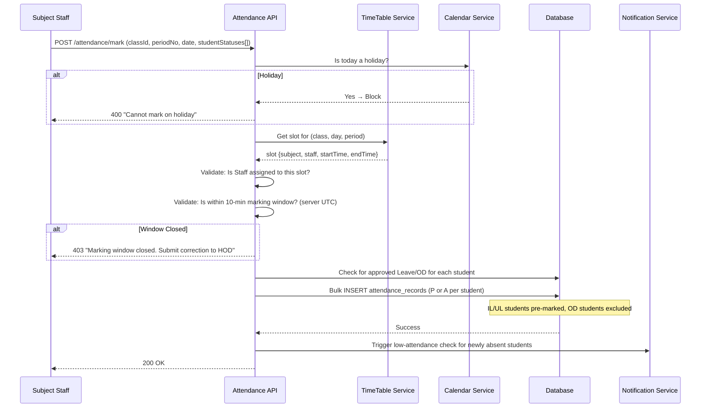

### 5.2 Leave Approval Flow

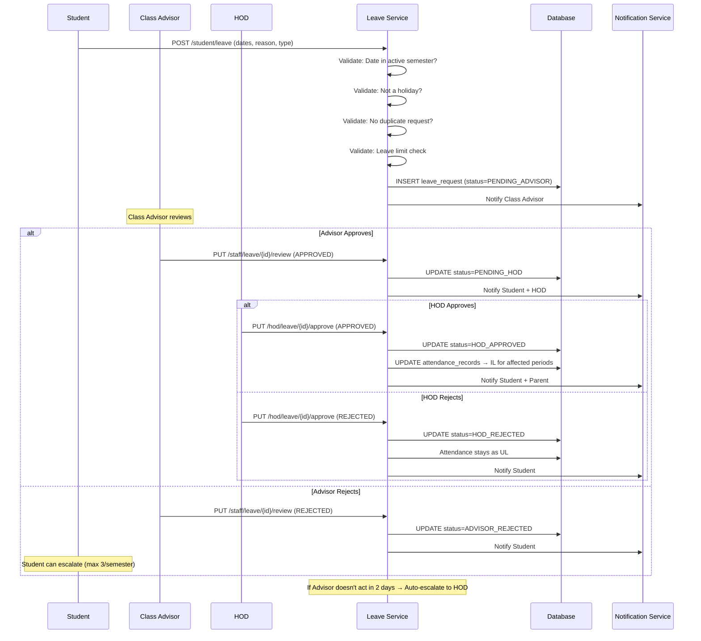

### 5.3 Staff Absent Scenario

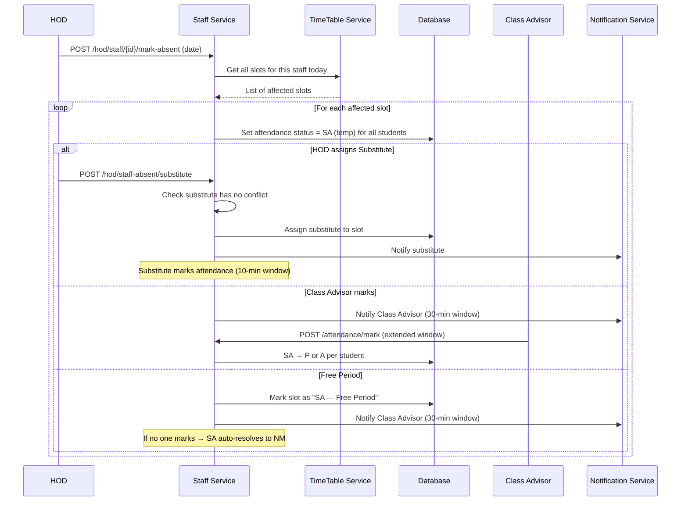

### 5.4 Attendance Correction Flow

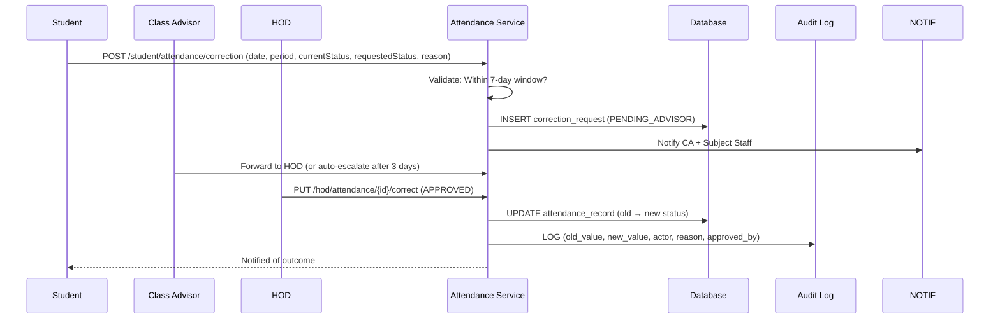

---

## 6. Security Architecture

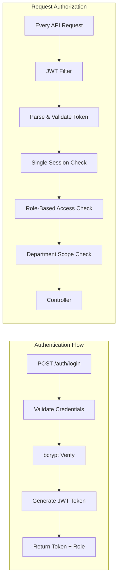

### Security Rules

| Rule | Implementation |
|---|---|
| **Password hashing** | bcrypt with salt rounds = 12 |
| **JWT** | HS256, 30-min expiry, refresh via re-login |
| **Single session** | Store active JWT ID in DB/Redis. Invalidate old on new login |
| **RBAC** | Spring Security `@PreAuthorize` annotations per endpoint |
| **Department scoping** | Custom `@DepartmentScope` annotation — HOD/Staff can only access their dept data |
| **Classroom scoping** | Class Advisor can access cross-dept classroom if assigned (EC-AUTH-06) |
| **HTTPS** | Enforced via Spring Security `requiresSecure()` |
| **Input validation** | Jakarta Bean Validation + custom XSS filter |
| **SQL Injection** | Prevented by JPA parameterized queries |
| **Audit trail** | Append-only table, no UPDATE/DELETE operations |
| **First login** | `must_change_password = true` on account creation |

### Role Permission Matrix

| Resource | ADMIN | PRINCIPAL | HOD | STAFF (CA) | STAFF (SS) | STUDENT |
|---|---|---|---|---|---|---|
| System Config | ✅ R/W | ✅ R/W | ❌ | ❌ | ❌ | ❌ |
| Departments | ❌ | ✅ CRUD | ✅ Read (own) | ❌ | ❌ | ❌ |
| ClassRooms | ❌ | ✅ Approve | ✅ CRUD (own dept) | ✅ Read (own) | ❌ | ❌ |
| Subjects | ❌ | ✅ Read | ✅ CRUD (own dept) | ✅ Read (own) | ✅ Read (own) | ❌ |
| Timetable | ❌ | ✅ Read | ✅ CRUD (own dept) | ✅ Read | ✅ Read | ✅ Read |
| Mark Attendance | ❌ | ❌ | ❌ | ✅ (SA only) | ✅ (own subject) | ❌ |
| Correct Attendance | ❌ | ❌ | ✅ Approve | ✅ Request | ✅ Request | ✅ Request |
| Leave Approve | ❌ | ❌ | ✅ Final | ✅ First-level | ❌ | ❌ |
| View Attendance | ❌ | ✅ All | ✅ Own dept | ✅ Own class | ✅ Own subject | ✅ Own only |
| User Management | ✅ All | ✅ HODs | ✅ Staff | ✅ Students | ❌ | ❌ |
| Audit Logs | ✅ All | ✅ All | ✅ Own approvals | ❌ | ❌ | ❌ |
| Password Reset | ✅ Any user | ❌ | ❌ | ❌ | ❌ | ❌ |

---

## 7. Notification Architecture

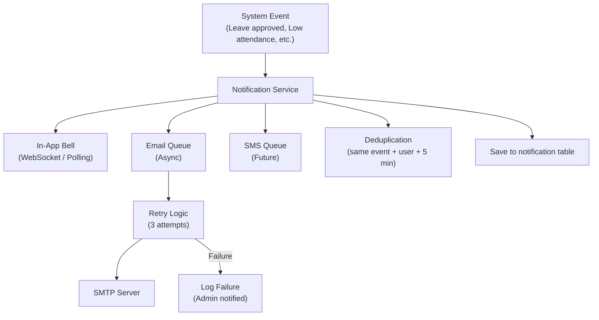

### Async Event Handling

Use **Spring Events** (`@EventListener` + `@Async`) for decoupled notification triggers:

```java
// Event published by any service
applicationEventPublisher.publishEvent(new AttendanceBelowThresholdEvent(student, percentage));

// Listener picks it up asynchronously
@Async
@EventListener
public void handleLowAttendance(AttendanceBelowThresholdEvent event) {
    notificationService.notify(event.getStudent(), ...);
    emailService.sendAlertToParent(event.getStudent().getParentPhone(), ...);
}
```

---

## 8. Attendance % Calculation Strategy

> **Never stored. Always computed in real-time.**

```sql
-- Attendance % for a student in a specific subject
SELECT 
    COUNT(CASE WHEN status = 'P' THEN 1 END) AS present_count,
    COUNT(CASE WHEN status IN ('P', 'A', 'IL', 'UL') THEN 1 END) AS total_countable,
    ROUND(
        COUNT(CASE WHEN status = 'P' THEN 1 END) * 100.0 / 
        NULLIF(COUNT(CASE WHEN status IN ('P', 'A', 'IL', 'UL') THEN 1 END), 0),
        2
    ) AS attendance_percentage
FROM attendance_record
WHERE student_id = :studentId
  AND subject_id = :subjectId
  AND attendance_date >= :semesterStart
  AND attendance_date <= CURRENT_DATE
  AND status NOT IN ('OD', 'SU', 'NM', 'H', 'SA');
```

### Caching Strategy

For dashboards that display attendance % frequently:
- **Redis cache** with key: `att:{studentId}:{subjectId}:{semester}` → TTL 5 min
- **Invalidation**: On any attendance record INSERT/UPDATE for that student+subject combo

---

## 9. Saturday Cyclic Timetable Logic

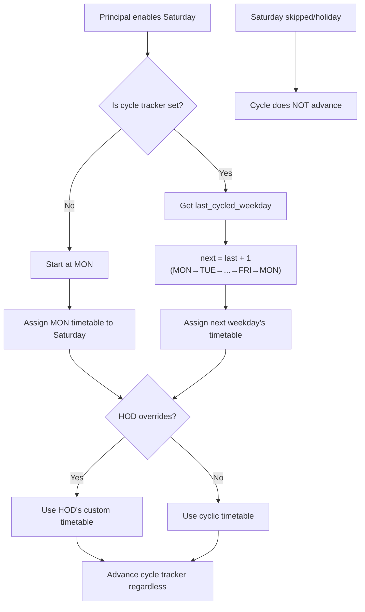

### Tracking Table

```sql
CREATE TABLE saturday_cycle_tracker (
    id BIGINT PRIMARY KEY AUTO_INCREMENT,
    classroom_id BIGINT NOT NULL,
    academic_year_id BIGINT NOT NULL,
    last_cycled_weekday ENUM('MON','TUE','WED','THU','FRI') DEFAULT NULL,
    UNIQUE(classroom_id, academic_year_id)
);
```

---

## 10. Scheduled Jobs (Background Tasks)

| Job | Schedule | Description |
|---|---|---|
| **Auto-escalate leave** | Every 6 hours | Escalate leave requests unacted for 2+ days to HOD |
| **Auto-escalate corrections** | Daily midnight | Escalate corrections unresolved for 3+ days to Principal |
| **Resolve SA → NM** | Every hour | Auto-resolve unresolved SA statuses to NM after 30-min window |
| **Semester overdue check** | Daily | Flag semesters past end date but still ACTIVE |
| **Saturday auto-holiday** | Friday 11:59 PM | Mark un-enabled Saturdays as holidays |
| **Notification cleanup** | Weekly | Archive notifications older than 6 months |
| **Daily backup** | 2:00 AM | Automated database backup |
| **Low attendance alerts** | End of each day | Recalculate and alert students below threshold |

Implemented using **Spring `@Scheduled`** with cron expressions.

---

## 11. Deployment Architecture (MVP)

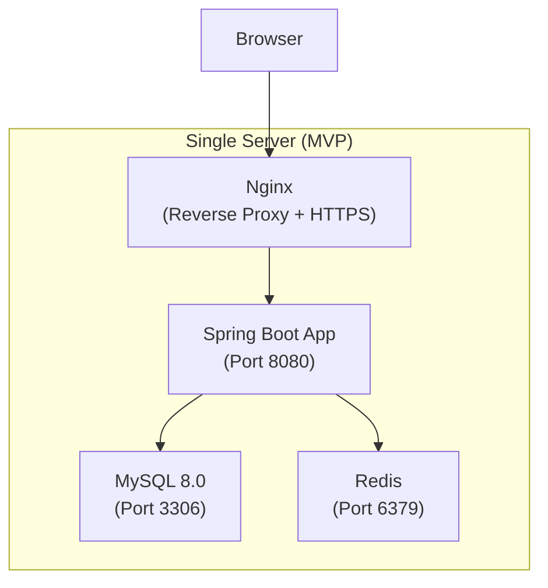

### MVP Deployment

- **Single Linux server** (AWS EC2 / DigitalOcean / College server)
- **Nginx** as reverse proxy + SSL termination
- **Systemd** for Spring Boot process management
- **mysqldump** for daily backups to local + cloud storage

---

## 12. Module Dependency Graph

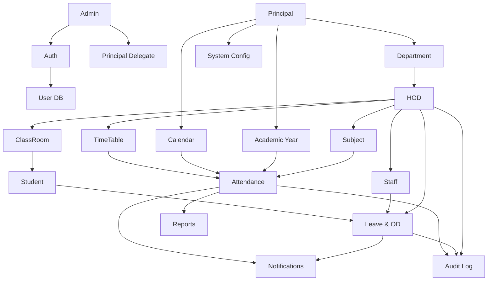

---

## 13. Error Handling Strategy

### Global Exception Handler

```java
@RestControllerAdvice
public class GlobalExceptionHandler {
    // 400 - Validation errors (human-readable messages)
    // 401 - Authentication failures
    // 403 - Authorization failures (wrong role / wrong dept)
    // 404 - Resource not found
    // 409 - Conflict (duplicate, optimistic lock)
    // 422 - Business rule violations (window closed, limit exceeded)
    // 500 - Internal server errors (logged, Admin notified)
}
```

### Standard Error Response

```json
{
    "timestamp": "2026-02-22T10:30:00Z",
    "status": 422,
    "error": "Business Rule Violation",
    "message": "Attendance marking window has closed. Submit a correction request to HOD.",
    "path": "/api/staff/attendance/mark",
    "details": {
        "period": 3,
        "windowClosed": "09:10:00",
        "currentTime": "09:25:00"
    }
}
```

---

## Related

- [[Sprint_Plan]] — 7-day implementation plan
- [[AttendanceWebApp/index]] — Project master index
- [[Auth]] — Authentication & authorization requirements
- [[Non-frunctional_reuirment]] — Non-functional requirements
- [[EdgeCaseRegistry]] — All edge cases

